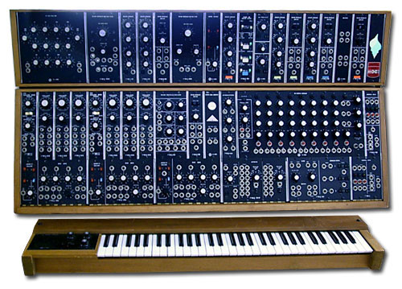
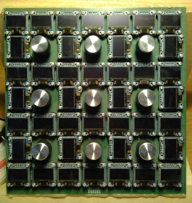

# SDHI based on the Raspberry Pi Pico

## What is SDHI
SDHI (Software Defined Hardware Interface) is a technology that
combines the benefit of pure software interfaces with ease of use and
tactile feedback of hardware interfaces. It models a hardware
interface based on groups of controllers as commonly found on
e.g. modular synthesizers.


*Example of modular synthesizer, [CC BY 3.0](https://creativecommons.org/licenses/by/3.0) [Kimi95](https://commons.wikimedia.org/wiki/File:Moog_Modular_55_img2.jpg)*

This is achieved by replacing the traditional hardware faceplate with
a matrix of displays. This matrix can be configured to display
arbitrary faceplate graphics.


*Example of early SDHI prototype, [CC BY 3.0](https://creativecommons.org/licenses/by/3.0) [Petter Arvidsson](https://github.com/petterarvidsson/display-board-pico)*


## Building

It can be built like any pico project using cmake

### Generate makefile
```
mkdir build
cd build
cmake ..
```

### Debug via gdb

There is a gdb command file included to make debugging using openocd
easier. (It automatically connects openocd, no need to start it
separately)

```
gdb-multiarch -x gdbcommands
...
blc
```

Where `blc` will build, load and start the process.
